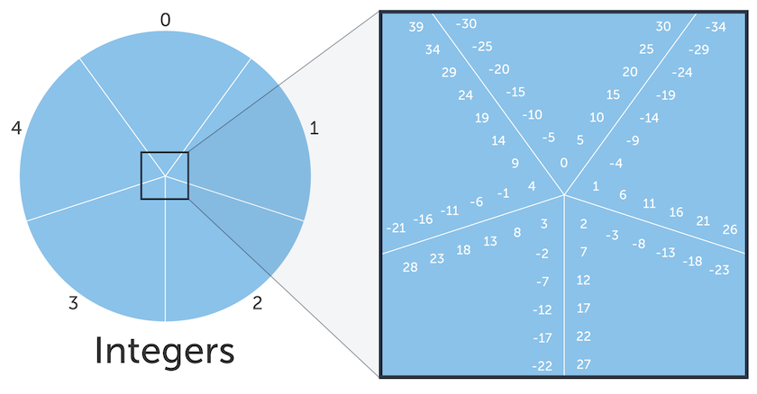

# Binary multiples of 3
The task is to create a regular expression capabale of evaluating binary strings (with 1s and 0s).  
**Take into the account that**:
- The input should consist of only binary digits
- There might be leading 0s

If you want to understand better the inner principles behind it, you might want to study how to get  
the modulo of an arbitrarily large number taking one digit at a time.

## Theory

$$ A \equiv B\ (\textrm{mod}\ C)$$

This says that A is **congruent** to B modulo C. Congruent means equivalent  

Suppose we labeled 5 slices 0, 1, 2, 3, 4. Then, for each of the integers, we put it into a slice that  
marched the value of the integer 5.
 
It would be useful to have a way of expressing that numberts belonged in the **same slice**. A common way 
of expressing that is to say that integers are in the same **equivalence class**(the expression at the start)  

Examining the expression closer:
1. \\(\equiv\\) is the symbol for congruence, which means the values A and B are in the same  
    equivalence class.
2. \\(\textrm{mod}\ C \\) tells us what operation we applied to A and B.

e.g. \\(26 \equiv 11 \ (\textrm{mod}\ 5) \\)

